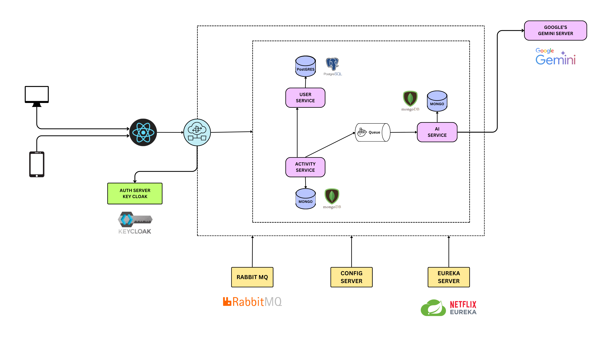
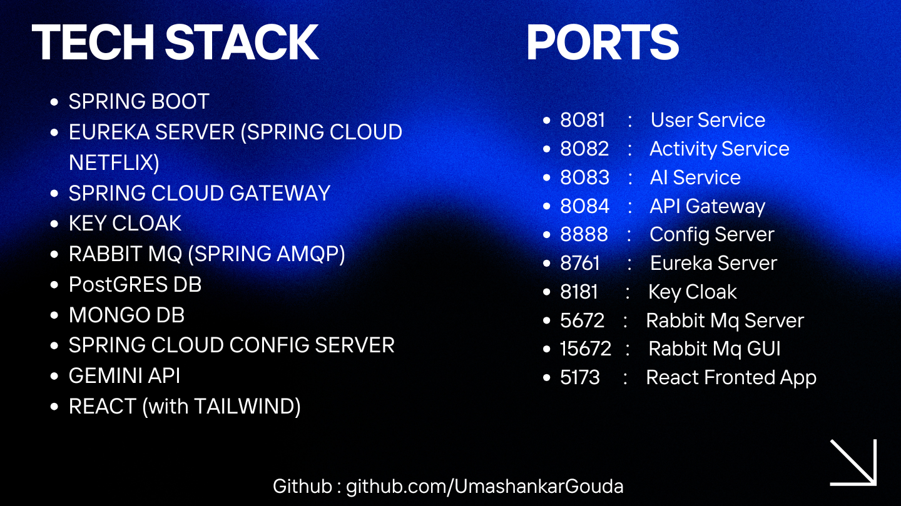

# 🏋️‍♂️ Spring Boot Microservices AI Fitness Platform


---

## 📌 Overview

A scalable and production-ready **AI-powered fitness tracking platform** built using **Spring Boot Microservices architecture**.

This application allows users to:
- Track fitness activities  
- Manage user profiles securely  
- Receive AI-powered recommendations  

It demonstrates **real-world distributed system design** using modern tools like API Gateway, Service Discovery, centralized configuration, and asynchronous messaging.

---

## 🏗️ System Architecture



### 🔹 Architecture Highlights

- Microservices-based architecture  
- API Gateway for centralized routing  
- Eureka for service discovery  
- Config Server for centralized configuration  
- Keycloak for authentication & authorization  
- RabbitMQ for event-driven communication  
- AI integration using Google Gemini  

---

## 🔄 Request Flow

1. Client (Web/Mobile) interacts with React Frontend  
2. Requests go through API Gateway  
3. Authentication handled via Keycloak  
4. Gateway routes request to appropriate service  
5. Services communicate via REST and RabbitMQ  
6. AI Service processes data using Gemini API  
7. Data stored in respective databases  

---

## 🧩 Microservices

| Service            | Description | Database |
|--------------------|------------|----------|
| User Service       | Manages users | PostgreSQL |
| Activity Service   | Tracks fitness activities | MongoDB |
| AI Service         | AI-based recommendations | MongoDB |
| API Gateway        | Request routing | — |
| Eureka Server      | Service discovery | — |
| Config Server      | Centralized configs | — |

---

## 🔐 Authentication

- Implemented using **Keycloak**
- OAuth2 & OpenID Connect based authentication  
- Centralized identity management  

---

## 🔄 Communication

### 🔹 Synchronous
- REST APIs via API Gateway  

### 🔹 Asynchronous
- RabbitMQ for event-driven architecture  

---

## 🛠️ Tech Stack

### Backend
- Java 17  
- Spring Boot  
- Spring Cloud (Eureka, Gateway, Config Server)  
- RabbitMQ  
- Keycloak  

### Frontend
- React.js  

### Databases
- PostgreSQL  
- MongoDB  

### AI
- Google Gemini API  

---

## 🌐 Port Mapping



> Shows how services are mapped to ports and interact internally.

---

## ⚙️ Setup & Execution

### 🔹 Prerequisites
- Java 17+  
- Node.js  
- Maven  
- PostgreSQL  
- MongoDB  
- RabbitMQ  
- Keycloak  

---

### 🔹 Execution Order

Run services in this order:

1. Config Server  
2. Eureka Server  
3. Keycloak Server  
4. API Gateway  
5. User Service  
6. Activity Service  
7. AI Service  
8. Frontend  

---

### 🔹 Run Backend

```bash
cd <service-folder>
mvn spring-boot:run
